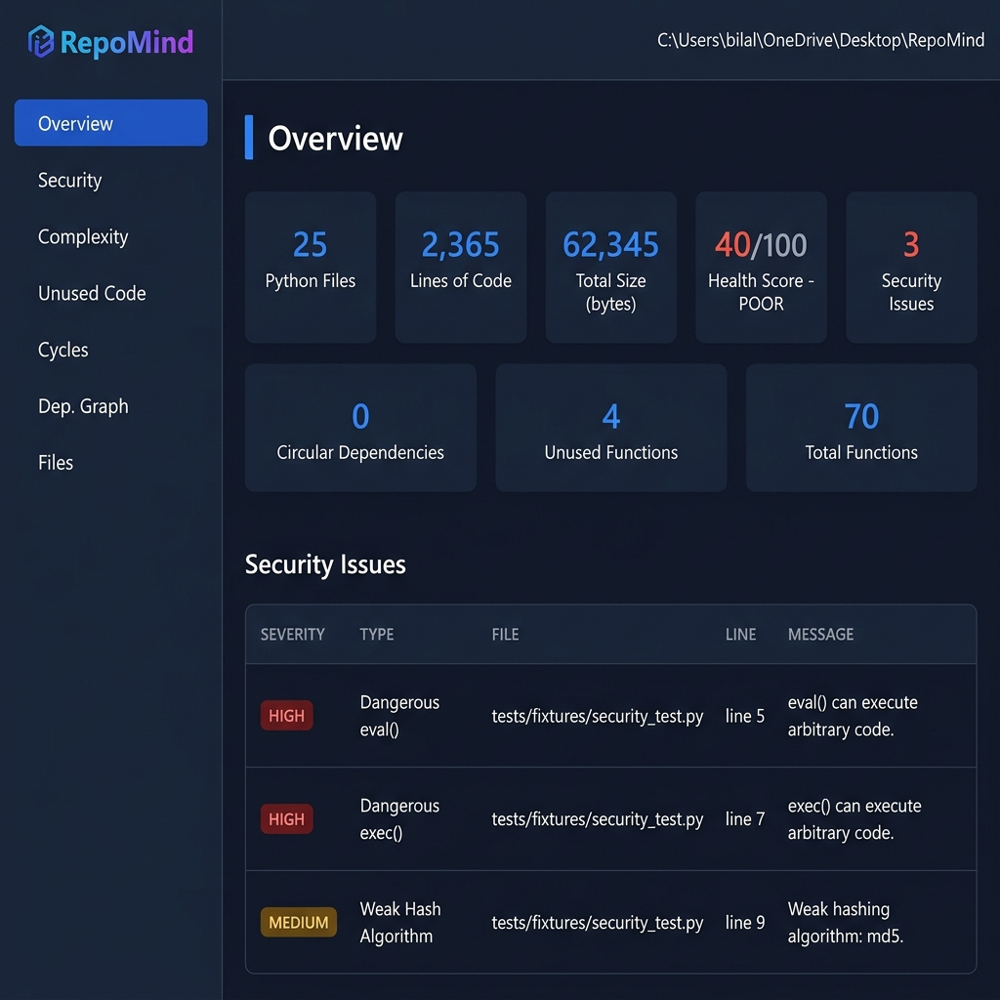
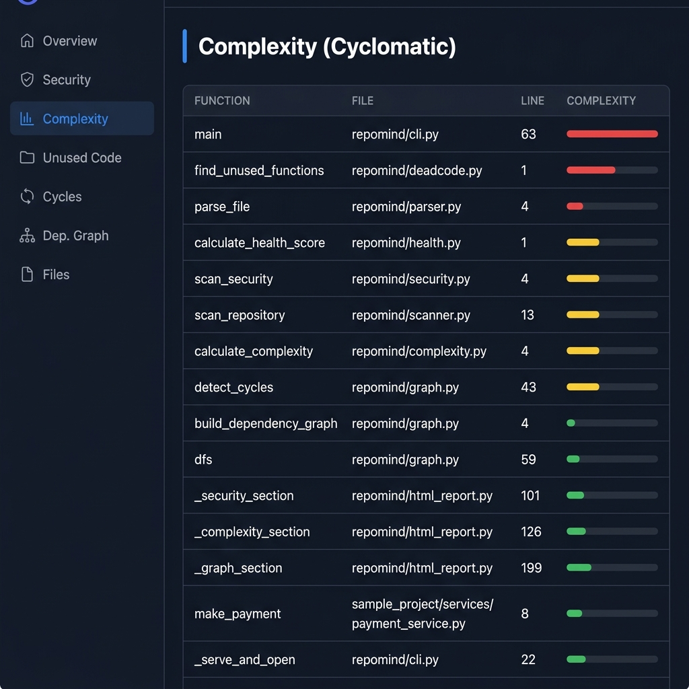
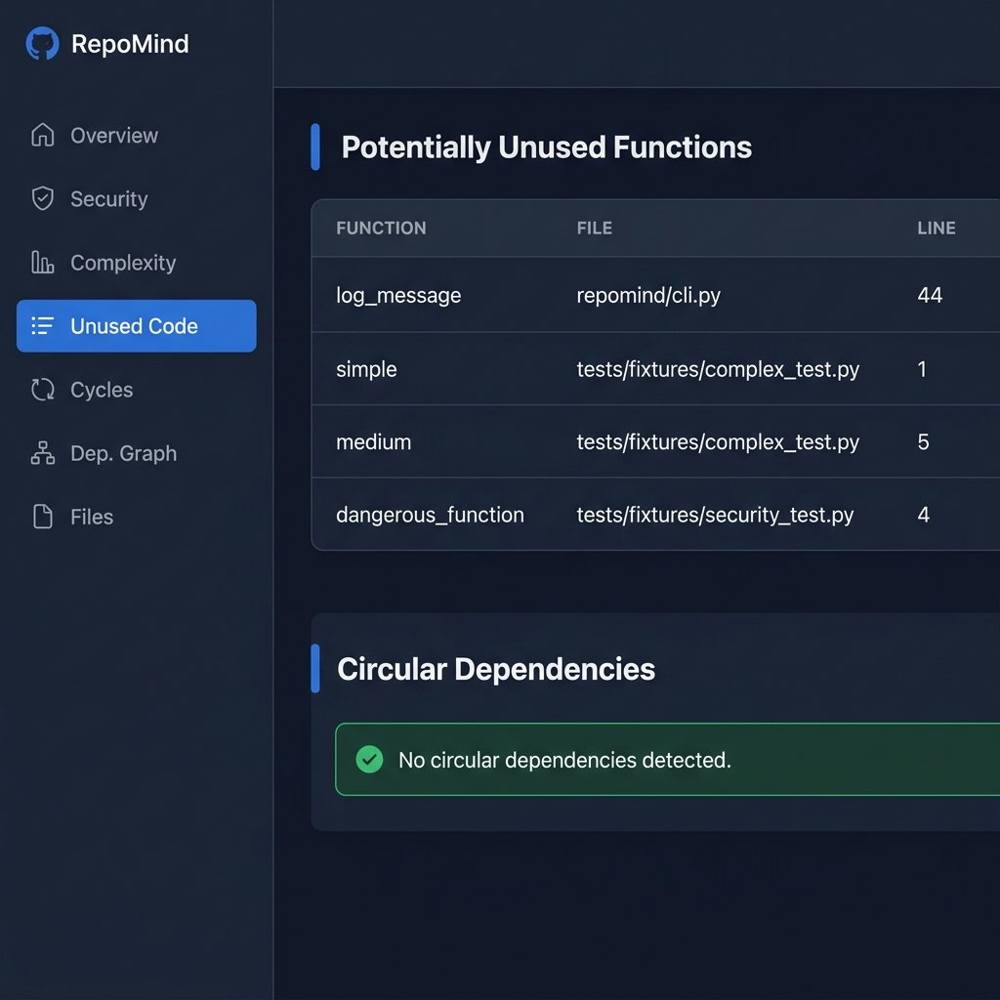
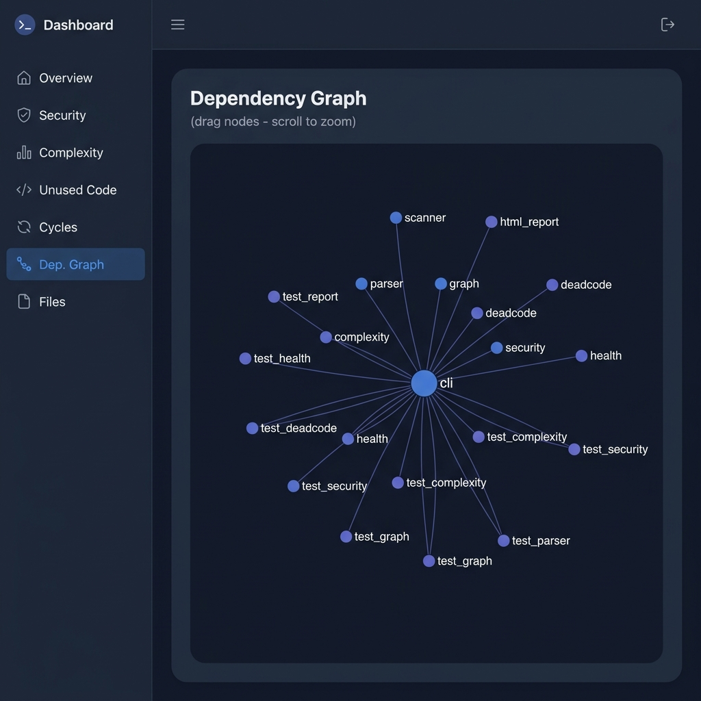
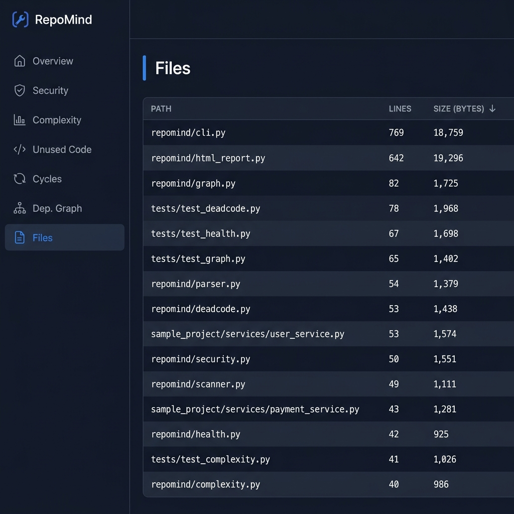

<div align="center">

# RepoMind

**A Python repository analysis CLI tool**

[](https://pypi.org/project/repomind/)
[](https://pypi.org/project/repomind/)
[](https://opensource.org/licenses/MIT)

</div>

RepoMind is a zero-dependency Python CLI tool that gives you an instant, deep understanding of any Python codebase — from the terminal or in a beautiful interactive HTML dashboard.

---

## Features

| Feature | Description |
|---|---|
| **Repository Overview** | File count, lines of code, total size |
| **Health Score** | Graded 0–100 (Excellent / Good / Fair / Poor) |
| **Security Analysis** | Detects dangerous `eval()`, `exec()`, weak hash algorithms |
| **Cyclomatic Complexity** | Per-function complexity scores, ranked by complexity |
| **Dead Code Detection** | Flags potentially unused functions across the codebase |
| **Dependency Graph** | Visualises which modules import which |
| **Circular Dependency Detection** | Finds import cycles that break maintainability |
| **Interactive HTML Dashboard** | Full visual report with a live D3.js dependency graph, served on localhost |

---

## Installation

```bash
pip install repomind
```

No additional dependencies required. RepoMind uses the Python standard library only.

---

## Quick Start

```bash
# Navigate to any Python project
cd my-project

# Run a full analysis
repomind
```

---

## CLI Reference

### Default Analysis

```bash
repomind
```

Analyzes the **current working directory** and prints a full report — code analysis, complexity, security, dependency graph, health score.

---

### Targeted Modes

```bash
repomind --security      # Security issues only
repomind --graph         # Dependency graph + circular dependencies
repomind --complexity    # Cyclomatic complexity per function
repomind --health        # Health score with breakdown
repomind --summary       # One-line health summary
```

---

### HTML Dashboard

```bash
repomind --html
```

- Runs the full analysis pipeline
- Generates an interactive HTML dashboard
- Starts a local HTTP server on an available port
- **Automatically opens the dashboard in your browser**
- Keeps the server alive until you press `Ctrl+C`

> The dashboard includes an interactive D3.js dependency graph — drag nodes, scroll to zoom.

To save the dashboard to a specific file:

```bash
repomind --html my_report.html
```

---

### Exclude Directories

```bash
repomind --exclude tests
repomind --exclude tests --exclude venv
repomind --html --exclude tests --exclude venv
```

Works with all modes.

---

### Analyze a Specific Path

```bash
repomind path/to/project
repomind ../other-project --security
```

---

### Version

```bash
repomind --version
```

---

## Example Output

```
REPO MIND
==================================================
Python Files: 12
Total LOC:   1840
Total Size:  42310 bytes

==================================================
REPOSITORY HEALTH
==================================================
Health Score: 78 / 100
Grade:        GOOD

Python Files: 12
Total LOC:    1840
Security Issues: 1
Circular Dependencies: 0
Unused Functions: 2
Most Complex: process_request (14)
```

---

## HTML Dashboard Preview

Running `repomind --html` opens a dark-mode dashboard in your browser with:

- **Overview cards** — files, LOC, health score, security count
- **Security issues table** — severity badges, file, line, message
- **Complexity table** — all functions ranked by cyclomatic complexity with inline bar charts
- **Unused functions** — dead code table
- **Circular dependencies** — highlighted import cycles
- **Interactive dependency graph** — D3.js force-directed graph, draggable and zoomable
- **File table** — all files sorted by size

### Overview & Security



### Complexity Analysis



### Unused Code & Circular Dependencies



### Interactive Dependency Graph



### File Explorer



---

## How It Works

```
Your Project
    └─ Scanner      → finds all .py files
    └─ Parser       → extracts functions, classes, imports, calls
    └─ Complexity   → calculates cyclomatic complexity per function
    └─ Security     → scans for dangerous patterns
    └─ Graph        → builds module dependency graph
    └─ Cycle Det.   → detects circular imports (DFS)
    └─ Dead Code    → finds uncalled functions
    └─ Health Score → computes 0–100 grade
    └─ Output       → CLI report or HTML dashboard
```

---

## Requirements

- Python 3.9 or higher
- Zero runtime dependencies (standard library only)

---

## License

MIT License — see [LICENSE](LICENSE) for details.
